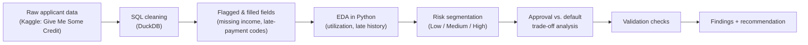
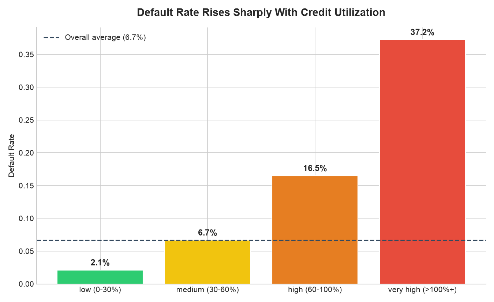
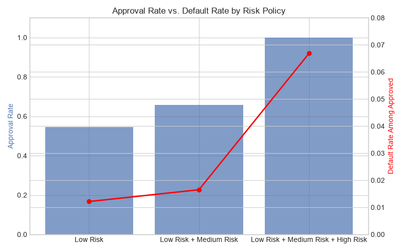

# Credit Approval Risk Trade-off Analysis

A data analyst portfolio project modeling how a lending company would set credit approval thresholds to balance approval volume against default risk, built as an inspectable, business-framed data analysis project.

This project ingests real applicant-level credit data, cleans and validates it against documented data-quality issues, segments applicants into risk tiers using two independent predictive signals, and quantifies the trade-off a lending company faces between approval rate and default exposure arriving at a specific, defensible policy recommendation.

## What This Demonstrates

| Data analyst requirement | Where it appears |
|---|---|
| SQL proficiency | Data cleaning and feature engineering performed via SQL queries (DuckDB), not just pandas shortcuts |
| Data quality investigation | Identified and documented 4 distinct data issues (impossible values, placeholder error codes, missing data) before any analysis began |
| Statistical reasoning | Segment-level default rates computed and compared against a baseline, with sample-size caveats noted for smaller segments |
| Business framing | Every finding is tied back to an explicit, quantified business trade-off, not left as a standalone chart |
| Visualization | Two purpose-built charts (bracket comparison, dual-axis trade-off curve), each with a stated takeaway |
| Validation mindset | A documented set of post-cleaning sanity checks, re-runnable against the pipeline |
| AI-augmented workflow | Built using AI tools as a debugging and learning partner throughout every query, chart, and decision was reviewed and understood, not copy-pasted |

## Pipeline



## Current Status

- **Phase 0:** Dataset sourced (Kaggle, "Give Me Some Credit," 150,000 applicant records), environment set up (Python, pandas, DuckDB, matplotlib)
- **Phase 1:** Data quality investigation and SQL-based cleaning — impossible values removed, placeholder codes flagged, missing data flagged and imputed
- **Phase 2:** Exploratory analysis - default rate baseline, utilization brackets, late-payment history
- **Phase 3:** Risk segmentation combining both signals into a 3-tier policy model
- **Phase 4:** Trade-off quantification - approval rate vs. default rate across three policy options
- **Phase 5:** Validation checks and writeup

## Key Findings

### Data Quality Issues Identified and Handled

| Issue | Records Affected | Treatment |
|---|---|---|
| Impossible age (age = 0) | 1 | Removed |
| Placeholder late-payment codes (96/98 — a documented artifact in this dataset) | 269 | Flagged (`has_late_payment_data_issue`), not deleted or trusted at face value |
| Missing `MonthlyIncome` | 29,731 (~20%) | Flagged (`income_was_missing`) and median-imputed |
| Missing `NumberOfDependents` | 3,924 (~2.6%) | Flagged and median-imputed |

### Finding 1 — Credit utilization predicts default with a consistent, monotonic relationship



| Utilization Bracket | Default Rate | Sample Size |
|---|---|---|
| Low (0–30%) | 2.1% | 82,004 |
| Medium (30–60%) | 6.7% | 21,887 |
| High (60–100%) | 16.5% | 31,909 |
| Very High (100%+) | 37.2% | 3,321 (*smaller sample - less stable estimate*) |

### Finding 2 — Late payment history is an even stronger, more balanced signal

Applicants with any late-payment history (excluding the 269 flagged data-quality records) default at **21.98%**, versus **2.84%** for those with none, an 8x difference across a well-balanced split (30,093 vs. 119,906 applicants).

### Finding 3 — Combining both signals into a risk policy produces a clear, actionable trade-off curve



| Policy | Approval Rate | Default Rate Among Approved |
|---|---|---|
| Approve Low Risk only | 54.7% | 1.2% |
| Approve Low + Medium Risk | 65.9% | 1.7% |
| Approve everyone (no policy) | 100.0% | 6.7% |

## Business Recommendation

**Rejecting only "High Risk" applicants (34% of the pool) allows a lender to approve 65.9% of applicants at a 1.7% default rate, down from a 6.68% baseline, avoiding 8,394 of 10,026 total defaults (83.7%).**

This is not presented as the single correct cutoff. A real risk team would evaluate this as one point on a broader curve, since the right threshold depends on whether the business is prioritizing growth or loss minimization in a given period. The three-policy comparison above is intended to make that trade-off explicit rather than hide it behind one number.

## Validation

Four checks were run against the final cleaned dataset to confirm the pipeline's output is trustworthy, not just plausible-looking:

- No missing values remain in key columns
- Risk segments sum to the total applicant count
- Default rate falls within a valid 0–1 range
- No negative ages remain

All four passed. This is a lightweight, re-runnable analogue to a proper evaluation harness, sized appropriately for an exploratory analysis project rather than a production model.

## Repository Map

```
credit-approval-risk-analysis/
  data/
    cs-training.csv           raw source data
    cleaned_credit_data.csv   cleaned, flagged, and validated output
  notebooks/
    01_explore_data.ipynb     full analysis, cleaning to recommendation
    default_by_utilization.png
    tradeoff_curve.png
  README.md
```

## Known Limitations

- The "Very High" utilization bracket (3,321 applicants) is meaningfully smaller than the other brackets, making that specific estimate less stable.
- This analysis uses a single, well-established benchmark dataset rather than live or recent lending data. It was chosen deliberately to focus on rigorous analysis and business framing rather than data-sourcing novelty, but a production policy would need validation against current data.
- Risk segmentation here is rule-based (two combined signals), not a fitted statistical model. It was built this way to keep the logic fully transparent and auditable, at the cost of the predictive lift a model could add.
- The policy was evaluated on the full dataset rather than a held-out test split, since the goal was exploratory business analysis rather than predictive modeling.

## Next Improvements

- Validate the recommended policy against a held-out test split rather than the full training set
- Incorporate additional signals (debt ratio, number of dependents) into the risk segmentation
- Compare the rule-based segmentation against a simple logistic regression model to quantify how much predictive lift a statistical model adds over the manual rules
- Extend the trade-off analysis into a continuous curve (e.g. ROC-style) rather than three discrete policy points 
